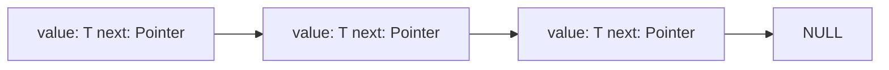

# Contiguous vs Linked

Data structures can be neatly classified as either **contiguous** or **linked**, depending upon whether they are based on arrays or pointers.

- **Contiguously-allocated structures** are composed of single slabs of memory, and include arrays, matrices, heaps, and hash tables.
- **Linked structures** are composed of distinct chunks of memory bound together by pointers, and include lists, trees, and graph adjacency lists.

## Arrays

Arrays are structures of fixed-size data records such that each element can be efficiently located by its index or equivalent address.

### Advantages

1. **Constant time access given the index**: Each index maps directly to the memory address.
2. **Space efficiency**: Arrays consist purely of data, so no space is wasted on links or other formatting information.
3. **Memory locality**: If iterating over elements, it is advantageous if elements are located adjacent to each other in memory.

### Disadvantages

The downside of arrays is that their size can't be changed during runtime. This can be overcome by allocating really large arrays, but this isn't space efficient.
We can though overcome this by using **dynamic arrays**. We can double an array each time we run out of space by creating a new array of twice it's current capacity and copying over the elements from the initial array.

## Linked Lists

Pointers are the connections that hold the pieces of linked structures together. They represent the address of a location in memory.



> Linked list with nodes containing a value of generic type `T` and pointer to the next node. A special NULL pointer value is used to denote structure-terminating or unassigned pointers.

### Generic Properties

1. Each node contains one or more data fields.
2. Each node contains a pointer field to at least one other node.
3. Finally, we need a pointer to the head of the structure.

The list is the simplest linked structure. The three basic operations supported are `search`, `insert`, and `delete`. In **doubly-linked lists**, each node points to both the next and previous nodes. This simplifies certain operations.

### Searching a List

Searching a list can be done either iteratively or recursively, as in the example below:

```rs
pub struct ListNode<T> {
    value: T,
    next: Option<Box<ListNode<T>>>,
}

pub fn search_list(node: &Option<Box<ListNode<i32>>>, x: i32) -> Option<&ListNode<i32>> {
    match node {
        Some(node) => {
            if node.value == x {
                Some(node)
            } else {
                search_list(&node.next, x)
            }
        },
        None => None,
    }
}
```

> In Rust, an `Option` type is how it handles undefined behavior. This type can produce either a `Some(T)` (where `T` is the value), or `None` indicating no value. A `Box` type, on the other hand, is a smart pointer that allocates the inner value on the heap and then destroys it when it goes out of scope.

### Inserting into a List

Since we don't have to maintain any kind of order, the place of insertion is arbitrary, and thus we can choose the easiest place to do so, which in this case is the beginning:

```rs
pub struct ListNode<T> {
    value: T,
    next: Option<Box<ListNode<T>>>,
}

pub fn insert_into_list<T>(head: &mut Option<Box<ListNode<T>>>, value: T) {
    let new_node = Box::new(ListNode {
        value,
        next: head.take(),
    });

    *head = Some(new_node);
}
```

> This function takes a mutable reference to the head of the list and a value of generic type `T`. It creates a new `ListNode` with the given value and the current `head` of the list as its `next` field. Then it replaces the `head` of the list with the new `node`. The `head.take()` call temporarily takes the value out of the head, replacing it with `None`, and then puts it back once the new `node` is created. This is necessary to satisfy Rust's borrowing rules.

### Deletion from a List

This is a bit more involved, because we first need the `predecessor node` to update its `next` pointer.

```rs
pub fn delete_list<T: PartialEq>(list: &mut Option<Box<ListNode<T>>>, x: T) {
    let mut node = list;
    while let Some(ref mut current) = *node {
        if current.value == x {
            *node = current.next.take();
            return;
        }
        node = &mut current.next;
    }
}
```

> This function takes a mutable reference to a `list` and a `value`. It iterates over the `list` until it finds a `node` with the `value`. It then removes this `node` from the `list` by updating the `next pointer` of the previous `node` to skip over the current `node`, effectively deleting it. The function does not explicitly track the `previous node`, but instead updates its `next field` when necessary to remove the `node` to be deleted.

## Comparison

### Lists

1. Overflow on linked structures can never happen unless the memory is full.
2. Insertions and deletions are simpler.
3. With large records, moving pointers is easier and faster than moving the items themselves.

### Arrays

1. More memory efficient because they don't need extra pointer information.
2. Allows efficient random access to items.
3. Better memory locality and cache performance.
